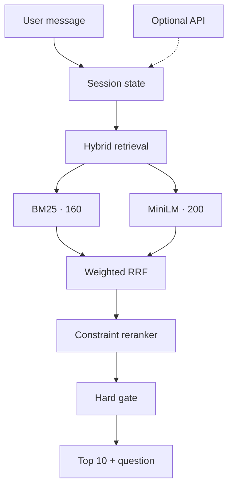

## Project: Shopping Copilot — SCOPE Agent

**SCOPE** stands for **Stateful Conversational Offline Product Engine**. It is a
multi-turn product-search agent designed for a frozen catalog of 50,000 items.
The agent interprets evolving shopping intent, asks targeted clarification
questions, and attempts to place the customer's hidden target product in the
Top 10 within no more than ten turns.

The submitted SCOPE Agent is offline-first. Its official inference path requires
no external LLM, API key, hosted vector database, or network connection. A
guarded OpenAI-compatible API adapter is retained as an optional future extension
for more complex language understanding, but it is disabled for the submitted
evaluation results.

## How Our Solution Addresses the Problem Statement

### Conversational state and intent handling

SCOPE maintains an isolated state for every session. It accumulates category,
material, color, size, budget, feature, use-case, and free-text evidence across
turns. Explicit override phrases clear obsolete preferences before new
requirements are applied. No-preference replies are recorded without creating
false constraints.

The clarification policy asks one structured question while continuing to
return recommendations in the same response. An open-ended must-have question
is asked before the size fallback so the four-question budget is not consumed by
an irrelevant slot.

### Hybrid retrieval and ranking

SCOPE combines complementary retrieval channels:

- SQLite FTS5 with Porter stemming provides weighted BM25-style retrieval for
  precise title, category, brand, and attribute terms.
- Local `all-MiniLM-L6-v2` embeddings provide semantic recall for use cases and
  paraphrased needs.
- Weighted reciprocal-rank fusion combines BM25 Top 160 and Dense Top 200.
- Constraint-aware reranking labels evidence as `MATCH`, `VIOLATION`, or
  `UNKNOWN` and rewards exact disclosed phrases.
- An explicit hard-constraint gate is applied only when the catalog contains
  clear contradictory evidence.

The normal Dense RRF weight is `0.25` relative to BM25's `1.0`. After an explicit
intent override it is reduced to `0.15`, because a newly reset query has less
evidence and is more vulnerable to semantic noise.

### Compact system architecture



The diagram uses a short top-to-bottom layout so it remains within standard
Markdown and Devpost content boundaries.

### Comparison with the official Baseline

Both systems were evaluated with the unchanged official evaluator and the same
fixed split IDs. Higher Hit Rate, MRR, and Technical Score are better; lower
MTTC is better.

| Split and model | Sessions | Hit Rate@10 | MRR | MTTC | Technical Score |
|---|---:|---:|---:|---:|---:|
| Development — official Baseline | 160 | 0.112500 | 0.055598 | 9.931250 | 0.094304 |
| Development — SCOPE Agent | 160 | **0.925000** | **0.594204** | **3.243750** | **0.795886** |
| Validation — official Baseline | 40 | 0.175000 | 0.117778 | 9.325000 | 0.156333 |
| Validation — SCOPE Agent | 40 | **0.950000** | **0.554573** | **2.825000** | **0.804872** |

On the fixed validation split, SCOPE increases Hit Rate@10 by `0.775`, increases
MRR by `0.436795`, reduces MTTC by `6.5` turns, and increases the Technical Score
by `0.648539` compared with the official Baseline.

## Runtime, Token Usage, and Cost

- Average latency per response: 42.942 ms
- P50 latency: 32.763 ms
- P95 latency: 106.168 ms
- External model/API calls: 0
- Prompt tokens: 0
- Completion tokens: 0
- Estimated model API cost: $0

Latency was measured locally on the complete 200-session public set with the
submitted `v6` configuration and the local Dense path enabled. The measurement
covers all 618 calls to `Agent.respond()` and excludes one-time catalog/index and
Agent initialization. Percentiles are calculated across individual response
latencies. The benchmark used Python 3.14.6 on macOS 26.6.2 (Apple Silicon); the
exact latency may vary with evaluator hardware and system load. SCOPE's local
MiniLM inference incurs compute time but no model API charge.

## Development Tools Used

| Tool | Purpose |
|---|---|
| Visual Studio Code | Python, Markdown, JSON, source review, and debugging |
| VS Code integrated terminal / macOS Terminal | Index construction, tests, and reproducible experiments |
| Miniconda | Isolated Python environment and dependency management |
| Python | Agent implementation, evaluation, data generation, and analysis |
| Git and GitHub | Branch-based collaboration, source control, and public submission |
| `unittest` and `compileall` | Contract regression tests and syntax verification |

The project does not depend on Colab or Jupyter Notebook. All reported metrics
are produced by command-line scripts and the unchanged official evaluator.

## APIs Used

### Official submission path

The official SCOPE inference path uses no external API. It reports zero prompt
and completion tokens and remains operational when network access is disabled.

### Optional OpenAI-compatible API extension

The repository retains a guarded chat-completions adapter for future deployment.
If explicitly configured, it may support intent classification, override
detection, structured constraint extraction, and short query rewriting. It does
not build embeddings, generate product IDs, select the final Top 10, or calculate
competition metrics. Invalid responses, timeouts, missing credentials, and
low-confidence output return control to the offline path.

Create a local `.env` file from this safe template:

```dotenv
TECHJAM_LLM_API_KEY=replace-with-your-own-key
TECHJAM_LLM_BASE_URL=https://your-provider.example/v1
TECHJAM_LLM_MODEL=your-model-name
TECHJAM_LLM_TIMEOUT_SECONDS=15
```

The template contains placeholders only. Real credentials must remain in a
Git-ignored local `.env` file and must never be committed, uploaded, logged, or
included in the submission archive.

## Libraries and Frameworks Used

| Library or framework | Purpose |
|---|---|
| NumPy | Memory-mapped product vectors, cosine similarity, and Top-K selection |
| Sentence Transformers | Local product and query encoding with `all-MiniLM-L6-v2` |
| PyTorch | Local inference backend for Sentence Transformers |
| Hugging Face Transformers | Transformer model runtime |
| SQLite FTS5 through Python `sqlite3` | In-memory weighted BM25-style retrieval with Porter stemming |
| Python `urllib.request` | Lightweight optional API adapter without a provider SDK |
| Python `dataclasses`, `json`, and `re` | Session state, JSONL processing, and deterministic extraction |
| Python `unittest` | Agent, evaluator, fusion, state, reranking, and API-safety tests |

No foundation model is trained or fine-tuned, and no hosted industrial vector
database is required.

## Datasets and Assets Used

### Official competition dataset

The organizer's frozen Track 4 kit is derived from the Amazon Reviews 2023
`Clothing_Shoes_and_Jewelry` category.

- Catalog: 50,000 products.
- Public labeled sessions: 200.
- Fixed public development split: 160 sessions.
- Fixed public validation split: 40 sessions.
- Private organizer evaluation: 800 sessions unavailable to participants.
- Scenario mix: 40% Buying, 40% Browsing, 15% Intent Override, and 5% Boundary.

Visible catalog fields include product ID, title, features, details, description,
price, categories, aggregate ratings, and store. Raw user IDs, individual reviews,
purchase history, and timestamps are not exposed to the agent.

### Local model assets

`sentence-transformers/all-MiniLM-L6-v2` produces 384-dimensional normalized
vectors. The 50,000-product `float32` matrix is approximately 73 MiB. Model and
index artifacts are stored under `artifacts/`. They must be supplied with the
submission package or a documented release asset so the offline Dense path can
be reproduced without downloading a model during scoring.

## Reproduction, Safety, and Limitations

```bash
python -m pip install -r requirements.txt
python scripts/build_dense_index.py --batch-size 128
python -m evaluator.local_evaluator
python -m unittest discover -s tests -v
```

The official evaluator, labels, metric formula, and catalog remain unchanged.
API keys, generated local evaluation data, per-run outputs, and local secrets
are excluded from Git.

Current limitations include the small 40-session public validation set,
deterministic handling of complex negation, and an interpretable weighted
reranker rather than a trained cross-encoder. The optional external API path also
introduces latency, token cost, and provider availability risk, so it remains
disabled for official offline evaluation.
